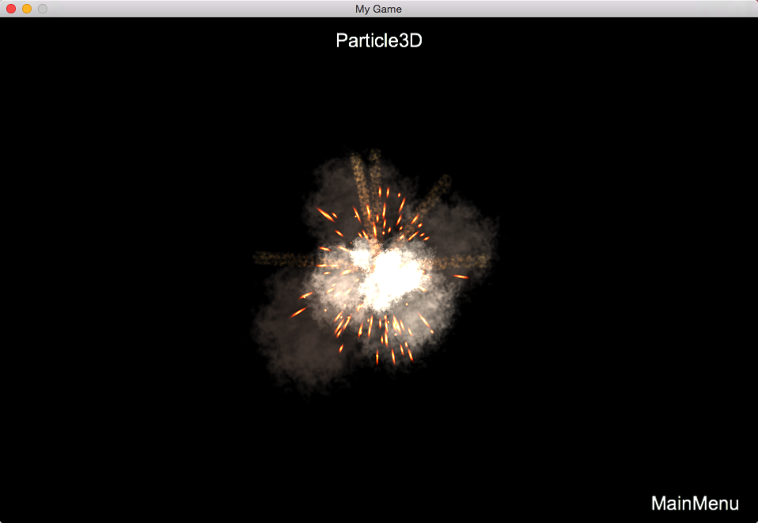
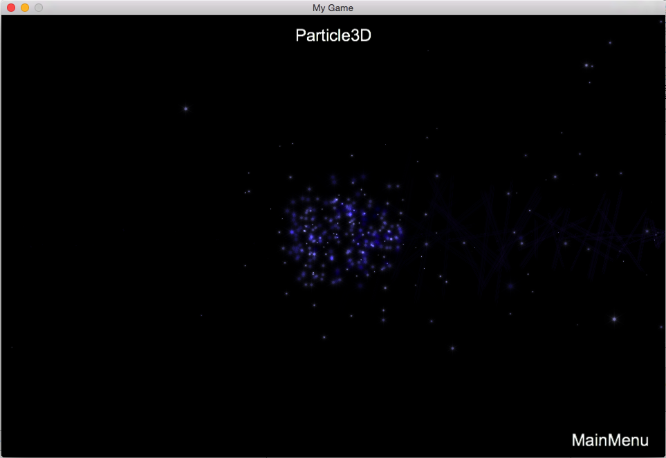
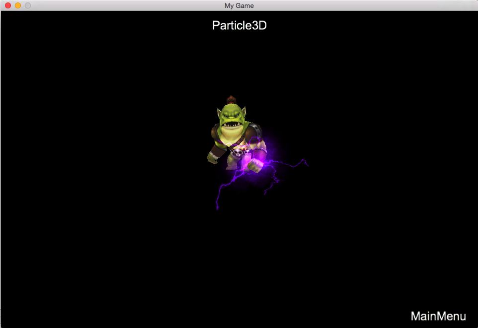

#ParticleSystem3D
## 介绍
cocos2d-x从3.5版本开始支持3D粒子系统，目前支持Particle Universe(http://www.fxpression.com/)构建的粒子系统。Particle Universe提供了专门的粒子编辑器，可以非常方便快速的设置各种特效，比如爆炸、火焰、加血、溅血等特效。编辑器导出.pu文件后，cocos2d-x直接通过解析脚本的方式构建粒子系统并渲染，快速高效。

## ParticleSystem3D的使用
如何创建ParticleSystem3D并显示？cocos2d-x的ParticleSystem3D从Node派生而来，所以支持Node的大部分功能(可参看Node的用法)。
PUParticleSystem3D从ParticleSystem3D派生而来，专门用来实现Particle Universe创建的粒子系统，PUParticleSystem3D提供两种创建粒子的方式：

第一种方式是通过传入一个PU文件路径和material文件路径来构建粒子(material文件包含了粒子所需的材质信息)，如下所示：

    auto ps = PUParticleSystem3D::create("lineStreak.pu", "pu_mediapack_01.material");
    ps->startParticleSystem();
	this->addChild(ps);

第二种方式是仅通过传入一个PU文件的路径来构建粒子系统。这种方式除了加载PU文件外还会自动加载规定文件夹下的所有material文件，如下所示：

    auto ps = PUParticleSystem3D::create("electricBeamSystem.pu");
    ps->startParticleSystem();
    this->addChild(ps);

如果确切的知道当前的PU文件使用的材质所在的material文件，建议使用第一种方式创建粒子系统，因为这样能节省预加载时间，并且节省内存空间。

PUParticleSystem3D的常用接口如下所示：

	virtual void startParticleSystem() override;
	virtual void stopParticleSystem() override;
	virtual void pauseParticleSystem() override;
	virtual void resumeParticleSystem() override;
	virtual int getAliveParticleCount() const override;

可以通过以上接口开始、暂停、继续、停止粒子系统，并可获取当前存活的粒子总数。

粒子渲染效果如下所示，左图为在Particle Universe编辑器中的效果，右图为在cocos2d-x运行的效果：

 

粒子系统因为派生自Node，所以支持Node的特性，比如可以进行Action操作,如下所示：

    auto ps = PUParticleSystem3D::create("blackHole.pu", "pu_mediapack_01.material");
    ps->setPosition(-25.0f, 0.0f);
    auto moveby = MoveBy::create(2.0f, Vec2(50.0f, 0.0f));
    auto moveby1 = MoveBy::create(2.0f, Vec2(-50.0f, 0.0f));
    ps->runAction(RepeatForever::create(Sequence::create(moveby, moveby1, nullptr)));
    ps->startParticleSystem();

亦或是把PUParticleSystem3D作为AttachNode挂载在模型的骨骼节点上，如下所示：

	auto sprite3d = Sprite3D::create("orc.c3b");
	sprite3d->setPosition3D(Vec3(0.0f, 0.0f, 0.0f));
	sprite3d->setRotation3D(Vec3(0.0f, 180.0f, 0.0f));
	auto animation = Animation3D::create("orc.c3b");
	if (animation)
	{
		auto animate = Animate3D::create(animation);
		sprite3d->runAction(RepeatForever::create(animate));
	}
	auto handlerps = PUParticleSystem3D::create("lightningBolt.pu");
	handlerps->startParticleSystem();
	sprite3d->getAttachNode("Bip001 L Hand")->addChild(handlerps);
	this->addChild(sprite3d);

目前cocos2d-x不支持Particle Universe特性如下，Particle Render中的Light Render，Emitter中的Vertex Emitter和Mesh Surface Emitter，Affector中的inter particle collider和collision avoidance affector。除此之外支持Particle Universe的所有特性。另外注意如果使用到模型粒子，由于Particle Universe支持的模型为.mesh文件，需要使用原始的fbx文件转换成c3b文件，放在相同目录替换.mesh文件才能导入到cocos2d-x中。

综上所述，我们可以通过粒子系统非常方便的构建很炫酷的场景效果。

**ParticleSystem3D更多的使用方法和细节请参看cpptests用例中的Particle3DTest**
